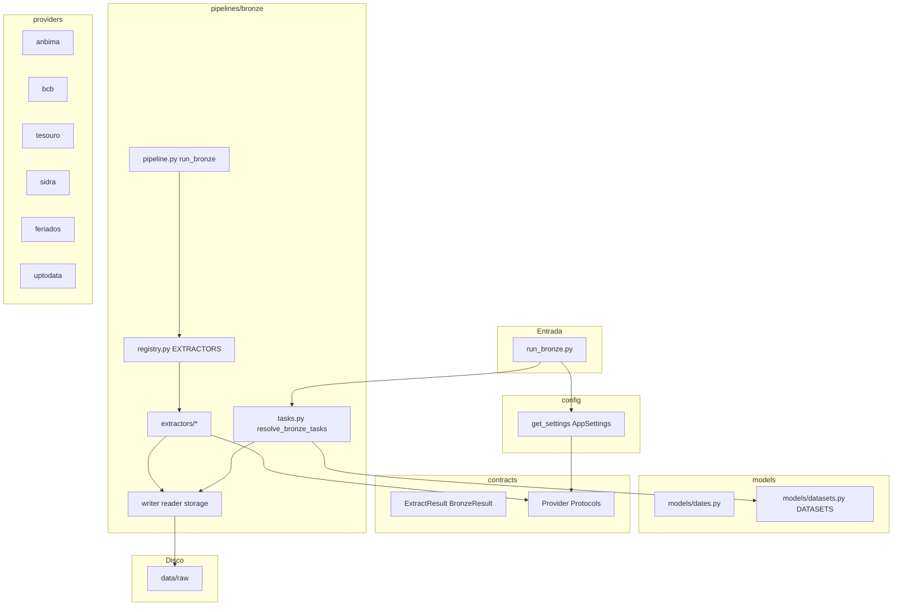

# Estudo de arquitetura: Bronze e ecossistema do projeto

Documento de estudo baseado no código em `src/` (branch de refatoração). Última revisão alinhada à estrutura com **53 testes** em `tests/`.

---

## 1. Visão geral do projeto atual

### Qual problema o projeto resolve

O **brazil_fixed_income_analytics** é um data lake para **títulos públicos brasileiros** e dados de mercado relacionados. Ele:

- Coleta dados de fontes públicas e privadas (ANBIMA, BCB, Tesouro, IBGE/SIDRA, arquivos BMF/UpToData).
- Persiste a camada **bronze** (bruta, fiel à fonte) em disco com layout **Hive**.
- Evoluirá para **silver** (normalizado), **gold** (SQLite/analítico) e, no futuro, API/Dash para clientes.

O código legado em [`legacy/rf_lake/`](../legacy/rf_lake/) já implementava Bronze → Silver → Gold com SQLite. A refatoração em `src/` reconstrói isso com fronteiras de camada mais rígidas.

### Papel da camada Bronze

A bronze **não calcula PU, taxa, DV01 nem curvas**. Ela:

1. Decide **quais partições** ainda faltam no disco (incremental).
2. Chama **providers** para buscar dados brutos.
3. Grava **um artefato por partição** (`part.json` ou `part.parquet`) sem schema canônico.

Layout padrão:

```text
data/raw/{dataset}/{partition_key}={valor}/part.{json|parquet}
```

Exemplo: `data/raw/mercado_secundario/data=2026-01-15/part.json`

### Módulos existentes hoje em `src/`

| Módulo | Status | Função |
|--------|--------|--------|
| [`src/config/`](../src/config/) | Implementado | Settings (.env), paths do projeto |
| [`src/contracts/`](../src/contracts/) | Implementado | Tipos e Protocols (sem I/O) |
| [`src/providers/`](../src/providers/) | Implementado | Clientes HTTP/arquivo por fonte |
| [`src/models/`](../src/models/) | Parcial | Datas + metadados de datasets |
| [`src/pipelines/bronze/`](../src/pipelines/bronze/) | Implementado | Ingestão raw particionada |
| [`src/pipelines/silver/`](../src/pipelines/) | **Não existe** | Previsto no README |
| `src/database/` | **Ainda não criado** | Previsto no README para gold/SQLite |
| `src/repositories/` | **Não existe** | Previsto no README |
| `src/services/` | **Não existe** | Previsto no README |
| [`src/main.py`](../src/main.py) | Placeholder | `NotImplementedError` |
| [`run_bronze.py`](../run_bronze.py) | Implementado | CLI da bronze |

### Como a Bronze se conecta ao resto



**Importante:** na implementação **atual**, a bronze **não grava no SQLite**. O path `SQLITE_DB_PATH` existe em config para uso futuro (gold). Persistência bronze = **filesystem** apenas.

---

## 2. Mapa completo da arquitetura atual

### Raiz do repositório (relevante)

| Caminho | Responsabilidade |
|---------|------------------|
| [`run_bronze.py`](../run_bronze.py) | CLI: `init`, `daily`, `one`, `backfill` |
| [`.env.example`](../.env.example) | Variáveis de ambiente documentadas |
| [`data/raw/`](../data/) | Bronze on-disk (gerado em runtime) |
| [`tests/`](../tests/) | Testes unitários (config, contracts, providers, bronze) |
| [`notebooks/test_providers.ipynb`](../notebooks/test_providers.ipynb) | Teste manual de providers |
| [`notebooks/test_bronze_reader.ipynb`](../notebooks/test_bronze_reader.ipynb) | Teste manual do reader |
| [`legacy/`](../legacy/) | Implementação anterior (`rf_lake`) |
| [`migrations/`](../migrations/) | `.gitkeep` — migrations SQL futuras |

### `src/config/`

| Arquivo | Responsabilidade |
|---------|------------------|
| [`paths.py`](../src/config/paths.py) | `PROJECT_ROOT` (raiz do repo a partir de `src/config/paths.py`) |
| [`settings.py`](../src/config/settings.py) | `AppSettings`, sub-settings por fonte, `get_settings()` com cache |
| [`__init__.py`](../src/config/__init__.py) | Reexporta `get_settings`, classes de settings |

**`AppSettings`** ([`settings.py`](../src/config/settings.py)) agrega:

- `paths` → `DATA_ROOT`, `SQLITE_DB_PATH`, `DATA_START_DATE`
- `anbima`, `feriados`, `bcb`, `tesouro`, `sidra`, `uptodata`
- Propriedades: `bronze_root` = `data_root / "raw"`, `silver_root`, `db_path`, `migrations_dir`
- `ensure_data_layout()` cria pastas em disco

### `src/contracts/`

| Arquivo | Conteúdo |
|---------|----------|
| [`bronze.py`](../src/contracts/bronze.py) | `ExtractResult`, `BronzeExtractor`, `BronzePartitionRef`, `BronzeResult` |
| [`providers.py`](../src/contracts/providers.py) | TypeAliases de fetch + `SidraIpcaProvider`, `AnbimaFeedClient` |
| [`__init__.py`](../src/contracts/__init__.py) | API pública de contratos |

### `src/providers/`

| Pasta / arquivo | Fonte | Saída típica |
|-----------------|-------|--------------|
| [`anbima/auth.py`](../src/providers/anbima/auth.py) | OAuth ANBIMA | Headers com token |
| [`anbima/client.py`](../src/providers/anbima/client.py) | API ANBIMA | JSON mercado secundário, projeções |
| [`feriados/client.py`](../src/providers/feriados/client.py) | XLS ANBIMA | `list[str]` datas ISO |
| [`bcb/client.py`](../src/providers/bcb/client.py) | ZIP NegE BCB | `DataFrame` bruto |
| [`tesouro/client.py`](../src/providers/tesouro/client.py) | API Tesouro | `list[dict]` leilões |
| [`sidra/client.py`](../src/providers/sidra/client.py) | SIDRA/sidrapy | `DataFrame` IPCA bruto |
| [`uptodata/client.py`](../src/providers/uptodata/client.py) | CSVs locais BMF | `DataFrame` ajustes |
| [`base.py`](../src/providers/base.py) | Utilitários compartilhados | — |

### `src/models/`

| Arquivo | Responsabilidade |
|---------|------------------|
| [`dates.py`](../src/models/dates.py) | `business_days`, `months_in_range`, `iso_month_first` |
| [`datasets.py`](../src/models/datasets.py) | `DATASETS`, `DatasetConfig`, `DateMode`, `get_dataset_config` |
| [`__init__.py`](../src/models/__init__.py) | Reexports; `DatasetTask` / `resolve_bronze_tasks` via lazy import |

**Nota:** `resolve_bronze_tasks` mora em [`pipelines/bronze/tasks.py`](../src/pipelines/bronze/tasks.py), não em `models`.

### `src/database/` e `repositories/`

- Não há pasta `src/database/` nem `src/repositories/` na refatoração atual (apenas previstas no README).
- Persistência relacional existe apenas no **legado** (`legacy/rf_lake/gold/db/`).

### `src/pipelines/bronze/`

| Arquivo | Responsabilidade |
|---------|------------------|
| [`tasks.py`](../src/pipelines/bronze/tasks.py) | `DatasetTask`, `resolve_bronze_tasks`, `_dates_for_dataset` |
| [`pipeline.py`](../src/pipelines/bronze/pipeline.py) | `run_bronze`, `run_bronze_phase` |
| [`registry.py`](../src/pipelines/bronze/registry.py) | `EXTRACTORS`, `extract_dataset` |
| [`extract_dataset.py`](../src/pipelines/bronze/extract_dataset.py) | Facade pública para `extract_dataset` |
| [`partitioning.py`](../src/pipelines/bronze/partitioning.py) | `PARTITION_SPECS`, `PIPELINE_NAMES`, granularidade |
| [`paths.py`](../src/pipelines/bronze/paths.py) | Caminhos Hive |
| [`storage.py`](../src/pipelines/bronze/storage.py) | `partition_artifact_exists` |
| [`writer.py`](../src/pipelines/bronze/writer.py) | Gravação JSON/Parquet |
| [`reader.py`](../src/pipelines/bronze/reader.py) | Leitura para silver/notebooks |
| [`incremental.py`](../src/pipelines/bronze/incremental.py) | `missing_partition_values` |
| [`_split.py`](../src/pipelines/bronze/_split.py) | Datas/partições em DataFrames |
| [`_extract_json.py`](../src/pipelines/bronze/_extract_json.py) | Loop JSON compartilhado |
| [`extractors/*.py`](../src/pipelines/bronze/extractors/) | Um extrator por dataset |

### `src/main.py` e `services/`

- [`main.py`](../src/main.py): placeholder — **não é** o entry point da bronze hoje.
- **Sem** `src/services/`.

---

## 3. Fluxo completo de execução

### Diagrama textual (implementação real)

```text
User / agendador
  ↓
run_bronze.py  (main → cmd_daily | cmd_one | cmd_backfill | cmd_init)
  ↓
get_settings()  →  load_dotenv(.env)  →  AppSettings
  ↓
ensure_data_layout()  →  cria data/raw, data/silver, data/meta, pasta do SQLite
  ↓
resolve_bronze_tasks()  [pipelines/bronze/tasks.py]
  │   usa DATA_START_DATE, business_days, months_in_range
  │   usa missing_partition_values para datasets diários
  ↓
list[DatasetTask]  (um por dataset em DATASETS)
  ↓
run_bronze_phase(tasks)  [pipeline.py]
  ↓
para cada task: run_bronze(name, task.dates)
  ↓
extract_dataset(name, dates)  [registry.py]
  ↓
extract_{dataset}(dates)  [extractors/*]
  │   missing_partition_values → só partições faltantes
  │   chama provider (HTTP / arquivo / sidrapy)
  │   write_partition_json | write_partition_parquet | write_dataframe_partitions
  ↓
ExtractResult(path, row_count, segment_keys)
  ↓
BronzeResult(status=success|skipped|error)  →  log + print CLI
  ↓
Artefato em data/raw/...  (NÃO passa por database nesta fase)
```

**Correção importante ao diagrama genérico:** não há `repository/database` na bronze atual. O “output” é **arquivo em disco**.

### Comando `daily` (passo a passo)

1. **`run_bronze.py`** → `cmd_daily()` → `resolve_bronze_tasks(target_date)`.
2. **`resolve_bronze_tasks`** ([`tasks.py`](../src/pipelines/bronze/tasks.py)):
   - `range_start` = `DATA_START_DATE` do `.env`
   - `candidates` = dias úteis de `range_start` até `target_date`
   - Para cada entrada em `DATASETS` ([`datasets.py`](../src/models/datasets.py)):
     - `missing_dates` → `dates` = partições diárias **ainda ausentes** em disco
     - `ipca_indice` / `projecoes` → `dates` = lista de meses `YYYY-MM-01` no intervalo
     - `feriados` → `dates` = `[]` (snapshot; extrator ignora lista)
3. **`run_bronze_phase`** executa os 7 datasets em sequência.
4. **`run_bronze`** chama extrator; se `row_count > 0` e `segment_keys` não vazio → `success`, senão `skipped`; exceção → `error` (não derruba os outros datasets no `phase`).

### Logs e erros

- Logging configurado em `run_bronze._setup_logging()` e parcialmente em `AppSettings._apply_log_level()`.
- Logger do pipeline: `lake.bronze.pipeline`.
- Erros no extrator são **capturados** em `run_bronze` e viram `BronzeResult(status="error", error=str(exc))`.
- Providers fazem retry (ANBIMA, BCB, Tesouro, SIDRA) com backoff simples.

---

## 4. Explicação dos contracts

### Princípios (regra de ouro)

| Afirmação | Verdade no projeto |
|-----------|-------------------|
| Contracts **não executam** nada | Sim — só dataclasses, TypeAlias, Protocol |
| Contracts **não acessam** providers | Sim — zero import de `providers` em `contracts/` |
| Contracts definem **interfaces e tipos** | Sim |
| Quem chama providers | `pipelines/bronze/extractors/*` |
| Quem orquestra | `run_bronze.py`, `pipeline.py`, `tasks.py` |

### [`contracts/bronze.py`](../src/contracts/bronze.py)

#### `ExtractResult`

- **O que padroniza:** retorno de um extrator bronze.
- **Campos:** `path` (último arquivo escrito), `row_count`, `segment_keys` (valores de partição gravados).
- **Quem produz:** cada `extract_*` em `extractors/`.
- **Quem consome:** `run_bronze` em `pipeline.py`.
- **Problema que evita:** cada extrator inventar formato de retorno diferente.

```python
# Contrato (simplificado)
@dataclass(frozen=True)
class ExtractResult:
    path: Path | None
    row_count: int
    segment_keys: list[str]
```

#### `BronzeExtractor`

- **Tipo:** `Callable[[list[str]], ExtractResult]`.
- **Uso:** dicionário `EXTRACTORS` em `registry.py`.

#### `BronzePartitionRef`

- **O que padroniza:** referência a uma partição no disco (para leitura iterativa).
- **Quem usa:** `reader.py` (`iter_partitions_in_range`).

#### `BronzeResult`

- **O que padroniza:** resultado da orquestração CLI (`success` / `skipped` / `error`).
- **Quem produz:** `run_bronze`.
- **Quem consome:** `run_bronze.py` (`_print_results`).

### [`contracts/providers.py`](../src/contracts/providers.py)

| Nome | Tipo | Implementadores / uso |
|------|------|------------------------|
| `DateRangeDataFrameFetcher` | `Callable[[Sequence[str]], pd.DataFrame]` | `fetch_negociacoes_bruto_por_datas`, `scrap_ajustes_bmf_for_dates` |
| `SnapshotDataFrameFetcher` | `Callable[[], pd.DataFrame]` | Padrão SIDRA (via classe) |
| `SnapshotDateListFetcher` | `Callable[[], list[str]]` | `fetch_feriados` |
| `DateRangeRecordFetcher` | `Callable[[Sequence[str]], list[dict]]` | `get_resultados_by_dates` |
| `SidraIpcaProvider` | Protocol | `SidraIpcaClient` |
| `AnbimaFeedClient` | Protocol | `AnbimaClient` (parcial — `fetch_projecoes` não está no Protocol) |

Testes de conformidade: [`tests/contracts/test_provider_contracts.py`](../tests/contracts/test_provider_contracts.py), [`tests/contracts/test_bronze.py`](../tests/contracts/test_bronze.py).

---

## 5. Explicação dos providers

### Tabela resumo

| Provider | Arquivo principal | Fonte | Contract | Extrator bronze |
|----------|-------------------|-------|----------|-----------------|
| ANBIMA | [`providers/anbima/client.py`](../src/providers/anbima/client.py) | API REST OAuth | `AnbimaFeedClient` | `mercado_secundario`, `projecoes` |
| Feriados | [`providers/feriados/client.py`](../src/providers/feriados/client.py) | XLS ANBIMA | `SnapshotDateListFetcher` | `feriados` |
| BCB | [`providers/bcb/client.py`](../src/providers/bcb/client.py) | ZIP NegE | `DateRangeDataFrameFetcher` | `liquidacoes_mercado` |
| Tesouro | [`providers/tesouro/client.py`](../src/providers/tesouro/client.py) | API Tesouro | `DateRangeRecordFetcher` | `leiloes` |
| SIDRA | [`providers/sidra/client.py`](../src/providers/sidra/client.py) | IBGE via sidrapy | `SidraIpcaProvider` | `ipca_indice` |
| UpToData | [`providers/uptodata/client.py`](../src/providers/uptodata/client.py) | CSV rede local | `DateRangeDataFrameFetcher` | `ajustes_bmf` |

### ANBIMA — [`AnbimaClient`](../src/providers/anbima/client.py)

- **Entrada:** `date_iso` (mercado secundário) ou `mes`/`ano` (projeções).
- **Saída:** `dict` / `list` JSON da API, ou `None` em 404.
- **Dependências:** `requests`, credenciais `ANBIMA_CLIENT_ID` / `ANBIMA_CLIENT_SECRET`.
- **Falhas comuns:** token inválido, 404 sem dados no dia, timeout.

### SIDRA — [`SidraIpcaClient`](../src/providers/sidra/client.py)

- **Entrada:** config `SIDRA_DEFAULT_PERIOD` (padrão `"last 60"`).
- **Saída:** `DataFrame` bruto sidrapy (colunas `D2C`, `V`, etc.).
- **Falhas:** rede, mudança de layout da tabela, `sidrapy` não instalado.

### BCB — [`fetch_negociacoes_bruto_por_datas`](../src/providers/bcb/client.py)

- **Entrada:** lista de datas ISO.
- **Saída:** um `DataFrame` concatenado (bruto NegE).
- **Bronze:** extrator reparte por dia e grava parquet por partição.

### Feriados — [`fetch_feriados`](../src/providers/feriados/client.py)

- **Saída:** lista de strings `YYYY-MM-DD`.
- **Bronze:** um único snapshot `snapshot=1/part.parquet`.

### Tesouro — [`get_resultados_by_dates`](../src/providers/tesouro/client.py)

- **Saída:** lista de dicts de leilões.
- **Bronze:** agrupa por `dataLeilao` e grava JSON por dia.

### UpToData — [`scrap_ajustes_bmf_for_dates`](../src/providers/uptodata/client.py)

- **Entrada:** datas + paths `UPTODATA_*` no `.env`.
- **Saída:** `DataFrame` de ajustes; bronze particiona por `RptDt`.

---

## 6. Explicação da camada Bronze

### Datasets e partições ([`partitioning.py`](../src/pipelines/bronze/partitioning.py))

| Dataset | partition_key | Granularidade | ext |
|---------|---------------|---------------|-----|
| mercado_secundario | data | day | json |
| liquidacoes_mercado | data | day | parquet |
| ajustes_bmf | data | day | parquet |
| leiloes | data | day | json |
| ipca_indice | reference_month | month | parquet |
| feriados | snapshot | snapshot | parquet |
| projecoes | reference_month | month | json |

`PIPELINE_NAMES = tuple(PARTITION_SPECS.keys())` — **fonte única** de nomes de pipeline.

### Extractor vs registry vs pipeline vs runner

| Conceito | Onde | Função |
|----------|------|--------|
| **Extractor** | `extractors/{dataset}.py` | Regra de negócio de **uma fonte**: buscar + gravar partições |
| **Registry** | `registry.py` | Mapa `nome → função extract_*` |
| **Pipeline** | `pipeline.py` | Orquestra **um** ou **vários** extractors com logging e `BronzeResult` |
| **Runner** | `run_bronze.py` | **CLI** humana: argumentos, `resolve_bronze_tasks`, chama pipeline |

Não existe classe `Runner`; o “runner” é o script `run_bronze.py`.

### Idempotência

- Implementada em [`incremental.py`](../src/pipelines/bronze/incremental.py) → `missing_partition_values`.
- Usa [`storage.py`](../src/pipelines/bronze/storage.py) → `partition_artifact_exists` (arquivo existe e tamanho > 0).
- **Reexecutar** `daily` não rebaixa partições já gravadas (a menos que apague manualmente a pasta).
- **Exceção:** IPCA/projeções mensais — novo mês aparece quando a API passa a tê-lo; mês já gravado **não** é atualizado se o IBGE revisar (limitação atual).

### Deduplicação

- **Não há** deduplicação semântica na bronze.
- “Dedup” prático = **não gravar de novo** a mesma partição (incremental por existência de arquivo).
- Deduplicação de linhas/colunas canônicas será papel da **silver**.

### Raw data

- Tudo em `data/raw` é **fiel à fonte** (JSON da API, parquet do sidrapy, etc.).
- Sem renomear colunas para schema de produto na bronze.

### O que **não** deve ser feito na Bronze (por design)

- Normalizar IPCA para `ref_month` / `ipca_mom` (silver).
- JOIN entre datasets.
- Escrever SQL / SQLite.
- Aplicar regras fiscais de precificação (`titulospub` / domínio de cálculo).
- Expor API HTTP a clientes.

### Arquivo por arquivo (bronze)

#### [`tasks.py`](../src/pipelines/bronze/tasks.py)

- Monta `DatasetTask(name, dates, config)`.
- Liga `DATASETS.date_mode` com `missing_partition_values` ou `months_in_range`.

#### [`registry.py`](../src/pipelines/bronze/registry.py)

- `EXTRACTORS`: 7 funções.
- `extract_dataset(name, dates)` despacha.

#### Extractors (padrões)

1. **JSON por dia** — `mercado_secundario` usa [`_extract_json.py`](../src/pipelines/bronze/_extract_json.py).
2. **JSON por mês** — `projecoes` (fetch ANBIMA por mês; partição por `mes_referencia`; refresh diário dos meses ativos com merge de coletas).
3. **Parquet por dia a partir de DF** — `liquidacoes_mercado`, `ajustes_bmf` via `write_dataframe_partitions`.
4. **JSON leilões agrupados** — `leiloes` (lógica própria).
5. **Snapshot** — `feriados`.
6. **SIDRA mensal** — `ipca_indice` (fetch tabela inteira, split por `D2C`, filtra `DATA_START_DATE`).

#### [`writer.py`](../src/pipelines/bronze/writer.py) / [`reader.py`](../src/pipelines/bronze/reader.py)

- Simetria leitura/escrita; reader para notebooks e futura silver.

---

## 7. Explicação dos models

| Arquivo | Tipo | Propósito | Onde usado |
|---------|------|-----------|------------|
| [`DatasetConfig`](../src/models/datasets.py) | dataclass | `name` + `date_mode` | `tasks.py`, `DATASETS` |
| [`DATASETS`](../src/models/datasets.py) | dict | Registro estático dos 7 pipelines | `resolve_bronze_tasks` |
| `DatasetTask` | dataclass em **tasks.py** | Instância de trabalho por execução | `pipeline.py`, CLI |
| [`business_days`](../src/models/dates.py) | função | Lista ISO dias úteis | tasks, reader |
| [`months_in_range`](../src/models/dates.py) | função | Lista `YYYY-MM-01` | tasks, IPCA/projeções |

**Não há** ORM/SQLAlchemy models em `src/models` hoje — isso seria gold/repositories no futuro.

`ExtractResult` / `BronzeResult` são **DTOs de pipeline** em `contracts/`, não em `models/`.

---

## 8. Config, database e repositories

### Configuração

1. `load_dotenv(PROJECT_ROOT / ".env")` em `get_settings()`.
2. Pydantic Settings por prefixo (`ANBIMA_`, `BCB_`, …).
3. Paths resolvidos contra `PROJECT_ROOT`.

### Database / repositories (estado atual)

| Componente | Status |
|-----------|--------|
| `src/database/` | Não existe em `src/` ainda |
| `src/repositories/` | Inexistente |
| `AppSettings.db_path` | Definido (`data/app.db`) para uso futuro |
| Legado `legacy/rf_lake/gold/db/` | SQLite + repositories funcionais |

### Por que pipeline bronze não deve escrever SQL

- Mistura ingestão raw com modelo analítico.
- Dificulta testes e replay a partir de arquivos.
- Viola a arquitetura alvo: **bronze = arquivos**, **gold = banco**.

### Acoplamentos atuais / melhorias

| Ponto | Situação |
|-------|----------|
| `models/datasets` importa `partitioning` de bronze | Metadado acoplado à bronze; aceitável com `assert` de chaves |
| `models/__init__` lazy-importa `tasks` | Evita ciclo de import com `reader` |
| README promete pastas ainda não criadas | Documentação à frente do código |
| Legado vs `src/` | Dois sistemas paralelos — migrar consumidores para `src/` |

---

## 9. Simulação: como um dev sênior implementaria do zero

| # | Etapa | Objetivo | Arquivos | Validação | Erro comum |
|---|--------|----------|----------|-----------|------------|
| 1 | Problema e datasets | Escopo claro | README, lista de fontes | Stakeholder alinhado | Pular definição de granularidade |
| 2 | Contracts mínimos | Tipos estáveis | `contracts/bronze.py`, `providers.py` | Import sem I/O | Colocar `requests` em contracts |
| 3 | Providers isolados | Fetch bruto funciona | `providers/*` | Notebook `test_providers` | Normalizar cedo demais |
| 4 | Testar providers | Rede/ credenciais OK | `.env`, notebook | Pull manual com print | Commitar secrets |
| 5 | Models/results | Datas + registry metadata | `models/dates`, `datasets` | Unit tests puros | Confundir com ORM |
| 6 | Config | `.env` e paths | `config/settings.py` | `get_settings().bronze_root` | Path absoluto hardcoded |
| 7 | partitioning + paths + storage | Layout Hive | `partitioning`, `paths`, `storage` | Path unit test | Misturar layout legado |
| 8 | writer + incremental | Gravar só o que falta | `writer`, `incremental` | Round-trip write | Sobrescrever sempre |
| 9 | Extractors + registry | 1 arquivo por fonte | `extractors/*`, `registry` | `one dataset` | God function única |
| 10 | tasks + pipeline | Orquestração | `tasks.py`, `pipeline.py` | `daily` dry-run | Lógica de datas no extrator |
| 11 | CLI | Operação | `run_bronze.py` | Equipe usa CLI | Só notebook |
| 12 | reader | Leitura padronizada | `reader.py` | Notebook bronze reader | Silver lê paths ad hoc |
| 13 | Repositories + DB | Gold (fora bronze) | `database/`, `repositories/` | Query IPCA | Bronze grava SQL |
| 14 | Silver | Schema canônico | `pipelines/silver/` | Parquet silver | Mapper na bronze |
| 15 | Testes CI | Regressão | `tests/` | pytest verde | Sem testes de alinhamento |
| 16 | Logs/monitoramento | Ops | logging, métricas | Log em erro ANBIMA | Swallow exception |

---

## 10. Análise crítica da implementação atual

### Pontos fortes

- Fronteira **providers** vs **bronze** vs **contracts** respeitada na refatoração.
- Layout Hive **consistente** e testado (`test_writer`, `test_reader`, `test_paths`).
- **Incremental** por partição claro e eficiente para re-runs.
- **PIPELINE_NAMES** alinhado a `PARTITION_SPECS` com assert.
- **Registry** uniforme (inclui `projecoes`).
- **Reader** simétrico ao writer — pronto para silver.
- Boa cobertura de testes para bronze (~53 testes).

### Pontos frágeis

- `main.py` e pastas README (`repositories`, `silver`) ainda não existem — expectativa vs realidade.
- Bronze **não atualiza** partições existentes (revisões IBGE/ANBIMA).
- `ipca_indice` chama SIDRA em todo `daily` mesmo sem mês novo (custo de API).
- `AnbimaFeedClient` incompleto vs métodos reais do client.
- Dois mundos: `legacy/` completo com gold vs `src/` só bronze.

### Riscos de acoplamento

- `models/datasets` depende de `lake.bronze.partitioning`.
- Cadeia `incremental` → `reader` → `storage` (baixo risco).
- Notebooks importando `models.datasets.PIPELINE_NAMES` — OK se partitioning estável.

### Funções grandes / duplicação

- `leiloes.py` e `ipca_indice.py` têm lógica específica (aceitável).
- `mercado` e `projecoes` compartilham `_extract_json` (melhoria recente).
- Legado duplica mappers em `legacy/rf_lake/bronze/sources/`.

### Nomes que podem confundir

- `DateMode.run_always` ≠ “ignora incremental”; significa “extrator roda sempre”, incremental ainda via `missing_partition_values`.
- `Pipeline` no README vs `pipelines/bronze` apenas bronze hoje.

### Melhorias futuras (sem quebrar contrato bronze)

1. Implementar `pipelines/silver` + mappers do legado.
2. `database/` + repositories para gold.
3. Watermarks em `data/meta/`.
4. Re-pull opcional dos últimos N meses IPCA.
5. `services/` para orquestrar bronze+silver+gold sem CLI monolítica.
6. Unificar ou deprecar `legacy/` explicitamente.

---

## 11. Guia de estudo (ordem de leitura)

| # | Arquivo | O que observar | Perguntas | Exercício |
|---|---------|----------------|-----------|-----------|
| 1 | [`.env.example`](../.env.example) | Variáveis por fonte | O que é obrigatório para ANBIMA? | Copiar para `.env` mínimo |
| 2 | [`config/settings.py`](../src/config/settings.py) | `AppSettings`, `bronze_root` | Onde entra `DATA_START_DATE`? | `get_settings().ensure_data_layout()` no REPL |
| 3 | [`contracts/providers.py`](../src/contracts/providers.py) | Protocols vs TypeAlias | Contracts importam providers? | Não — confirmar |
| 4 | [`contracts/bronze.py`](../src/contracts/bronze.py) | `ExtractResult` vs `BronzeResult` | Diferença entre eles? | Desenhar diagrama |
| 5 | [`providers/anbima/client.py`](../src/providers/anbima/client.py) | OAuth, retry, 404 | O que retorna sem dado? | Notebook `test_providers` |
| 6 | [`providers/sidra/client.py`](../src/providers/sidra/client.py) | sidrapy, período | Quantos meses vêm? | Print `df.columns` |
| 7 | [`models/datasets.py`](../src/models/datasets.py) | `date_mode` por dataset | Por que IPCA é `run_always`? | Listar `DATASETS.keys()` |
| 8 | [`models/dates.py`](../src/models/dates.py) | `business_days` vs `months_in_range` | Quando usar cada um? | `months_in_range("2026-01-15","2026-03-02")` |
| 9 | [`partitioning.py`](../src/pipelines/bronze/partitioning.py) | Spec por dataset | Qual extensão por pipeline? | Montar tabela de 7 linhas |
| 10 | [`incremental.py`](../src/pipelines/bronze/incremental.py) | `missing_partition_values` | Como funciona snapshot? | Criar partição fake e testar |
| 11 | [`writer.py`](../src/pipelines/bronze/writer.py) | JSON vs parquet | Onde cria diretórios? | `test_writer.py` |
| 12 | [`extractors/mercado_secundario.py`](../src/pipelines/bronze/extractors/mercado_secundario.py) | Uso de `_extract_json` | Fluxo em 5 linhas? | Traçar com debugger |
| 13 | [`extractors/ipca_indice.py`](../src/pipelines/bronze/extractors/ipca_indice.py) | SIDRA + filtro mês | Por que não usa só `dates`? | `one ipca_indice` |
| 14 | [`registry.py`](../src/pipelines/bronze/registry.py) | `EXTRACTORS` | Como adicionar dataset? | Ver test_bronze alinhamento |
| 15 | [`tasks.py`](../src/pipelines/bronze/tasks.py) | `resolve_bronze_tasks` | O que vai em `task.dates`? | `resolve_bronze_tasks("2026-01-17")` |
| 16 | [`pipeline.py`](../src/pipelines/bronze/pipeline.py) | success/skipped/error | Erro derruba phase? | Ler `run_bronze_phase` |
| 17 | [`run_bronze.py`](../run_bronze.py) | CLI | Diferença daily vs backfill? | `init` + `one feriados` |
| 18 | [`reader.py`](../src/pipelines/bronze/reader.py) | `read_range` | `only_existing`? | Notebook bronze reader |
| 19 | [`tests/contracts/test_bronze.py`](../tests/contracts/test_bronze.py) | Garantias estruturais | O assert de chaves protege o quê? | Quebrar de propósito e ver falha |
| 20 | [`legacy/rf_lake/bronze/pipeline.py`](../legacy/rf_lake/bronze/pipeline.py) | Comparação histórica | O que mudou no layout? | Diff mental com `src/` |

---

## 12. Checklist de domínio

Use para autoavaliação:

- [ ] **Fluxo:** Consigo explicar do `run_bronze.py` até o arquivo em `data/raw` sem olhar o código?
- [ ] **Novo provider:** Consigo adicionar uma função em `providers/` + teste de import sem tocar bronze?
- [ ] **Novo dataset:** Consigo adicionar entrada em `PARTITION_SPECS`, `DATASETS`, extrator, `EXTRACTORS` e teste?
- [ ] **Um extrator:** Sei rodar `python run_bronze.py one NOME [DATA]`?
- [ ] **Falha:** Sei simular ANBIMA sem credencial e ver `error` ou `skipped`?
- [ ] **Teste:** Sei escrever teste com `bronze_tmp_root` que grava e lê round-trip?
- [ ] **Contracts:** Consigo explicar por que `contracts/` não importa `providers`?
- [ ] **Silver (futuro):** Sei explicar que bronze guarda bruto e silver normaliza?
- [ ] **Database:** Sei explicar que bronze atual **não** usa SQLite?

---

## Apêndice A — Mapeamento extrator → provider → partição

| Extrator | Provider | Chave partição | Artefato |
|----------|----------|----------------|----------|
| `extract_mercado_secundario` | `AnbimaClient.fetch_by_date` | `data=YYYY-MM-DD` | json |
| `extract_liquidacoes_mercado` | `fetch_negociacoes_bruto_por_datas` | `data=YYYY-MM-DD` | parquet |
| `extract_ajustes_bmf` | `scrap_ajustes_bmf_for_dates` | `data=YYYY-MM-DD` | parquet |
| `extract_leiloes` | `get_resultados_by_dates` | `data=YYYY-MM-DD` | json |
| `extract_ipca_indice` | `SidraIpcaClient.fetch_table_ipca` | `reference_month=YYYY-MM-01` | parquet |
| `extract_feriados` | `fetch_feriados` | `snapshot=1` | parquet |
| `extract_projecoes` | `AnbimaClient.fetch_projecoes` | `reference_month=YYYY-MM-01` | json |

---

## Apêndice B — Comandos úteis

```powershell
$env:PYTHONPATH="src"
python run_bronze.py init
python run_bronze.py daily
python run_bronze.py one mercado_secundario 2026-01-15
python run_bronze.py backfill 2026-01-01 2026-01-17 ipca_indice
pytest tests/ -q
```

---

*Documento gerado para estudo interno. Para alterar comportamento do sistema, modifique o código em `src/` e os testes correspondentes — não este arquivo.*
